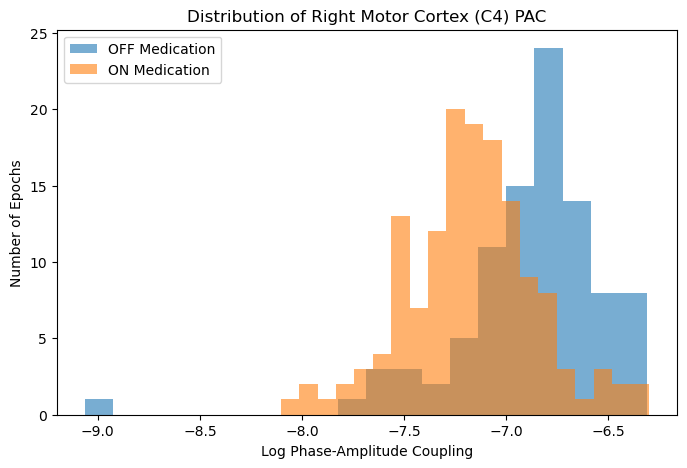

# Parkinson’s Disease Neurological State Classifier

Automated data orchestration and machine learning pipeline for classifying Parkinson's medication states (ON vs. OFF) using non-linear EEG biomarkers.

## Overview
This project processes raw clinical BDF datasets to extract cross-frequency and inter-hemispheric biomarkers. By leveraging **Phase-Amplitude Coupling (PAC)** and **Phase-Locking Values (PLV)**, the model achieves a 0.68 ROC-AUC in classifying medication states, demonstrating that clinical classification requires multidimensional feature engineering rather than simple spectral power analysis.

## Key Features
- **Automated Pipeline:** Full lifecycle orchestration from raw BIDS-formatted data to model training.
- **Biomarker Engineering:** Hilbert-transform based extraction of:
    - Theta/Beta Log Power
    - Inter-hemispheric Phase Locking (PLV)
    - Beta-Gamma Phase-Amplitude Coupling (PAC)
- **Reproducibility:** BIDS-compliant ingestion ensures scalability across datasets.

## Visual

*Figure: Comparison of PAC distributions showing the decoupling of Beta-Gamma interactions upon Levodopa medication.*

## Getting Started
1. Clone the repo: `git clone https://github.com/macblair221/parkinsons-eeg-classifier.git`
2. Install requirements: `pip install -r requirements.txt`
3. Run the pipeline: `python src/data_loader.py`

### Citations
Swann, N.C., de Hemptinne, C., Aron, A.R., Ostrem, J.L., Knight, R.T. and Starr, P.A. (2015), Elevated synchrony in Parkinson disease detected with electroencephalography. Ann Neurol., 78: 742-750. https://doi.org/10.1002/ana.24507

Alexander P. Rockhill, Nicko Jackson, Jobi George, Adam Aron, and Nicole C. Swann (2020). UC San Diego Resting State EEG Data from Patients with Parkinson's Disease. OpenNeuro. [Dataset] doi: 10.18112/openneuro.ds002778.v1.0.1
